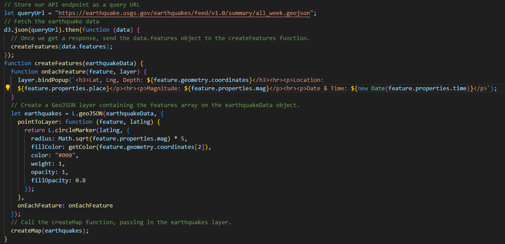
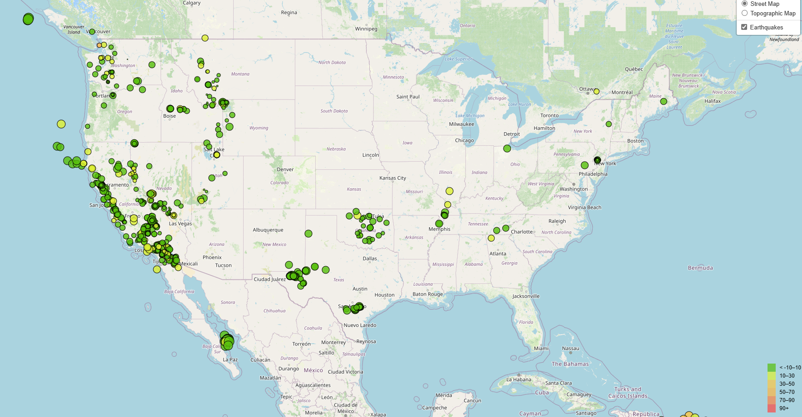

# Leaflet for Earthquake Visualization

# Summary:

This project involves visualizing earthquake data from the United States Geological Survey (USGS) to educate the public and government organizations about global seismic activity. By utilizing Leaflet and D3.js, the project aims to create interactive maps displaying earthquake magnitude and depth, along with providing additional information through popups and legends. 

# Sample Code for Functions:

# Screenshot of Final Output:

# File Information:
The completed code file is found in Leaflet-Part-1. 

